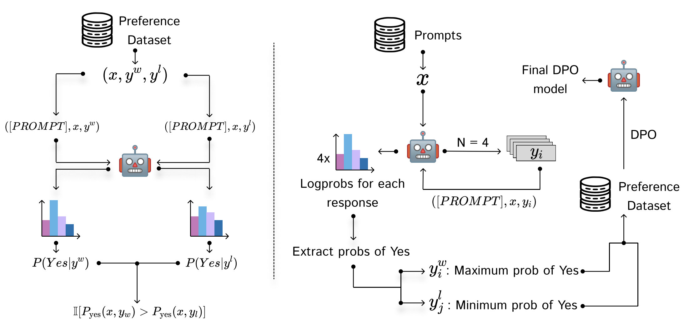

# IPO: Your Language Model is Secretly a Preference Classifier

Code and data for the paper "IPO: Your Language Model is Secretly a Preference Classifier"

Paper: https://arxiv.org/abs/2502.16182v1

Authors: Shivank Garg $^{1,2}$, Ayush Singh $^{1,2}$, Shweta Singh $^{1,3}$, Paras Chopra $^{2}$

$^1$ Indian Institute of Technology, Roorkee, $^2$ [Lossfunk](https://lossfunk.com/)

## Abstract: 
Reinforcement learning from human feedback (RLHF) has emerged as the primary method for aligning large language models (LLMs) with human preferences. While it enables LLMs to achieve human-level alignment, it often incurs significant computational and financial costs due to its reliance on training external reward models or human-labeled preferences. In this work, we propose Implicit Preference Optimization (IPO), an alternative approach that leverages generative LLMs as preference classifiers, thereby reducing the dependence on external human feedback or reward models to obtain preferences. We conduct a comprehensive evaluation on the preference classification ability of LLMs using RewardBench, assessing models across different sizes, architectures, and training levels to validate our hypothesis. Furthermore, we investigate the self-improvement capabilities of LLMs by generating multiple responses for a given instruction and employing the model itself as a preference classifier for Direct Preference Optimization (DPO)-based training. Our findings demonstrate that models trained through IPO achieve performance comparable to those utilizing state-of-the-art reward models for obtaining preferences.



## File Structure

```
IPO
├── Evals
│   ├── create_subset.py
│   └── sample_mmlu.py
├── merge_peft.py
├── ours.py
├── sample_responses.py
└── self_reward.py
```

```
Preference_Comparison
├── RM_Bench
│   ├── binary_gpt.py
│   ├── ours.py
│   ├── ours_gpt.py
│   ├── reward_model.py
│   ├── self_reward.py
│   └── self_reward_gpt.py
└── Reward_Bench
    ├── binary_gpt.py
    ├── candidate_prompts.json
    ├── ours.py
    ├── ours_gpt.py
    ├── prompt_search.py
    ├── reward_model.py
    ├── self_reward.py
    └── self_reward_gpt.py
```

## Setup
Installation
```
git clone https://github.com/shivank21/Implicit_Preference_Optimization.git
cd Implicit_Preference_Optimization
```

Create a conda environment
```
conda create -f environment.yaml
```

To evalute the preference modeling ability of any LLM on Reward Bench
```
python Preference_Comparison/Reward_Bench/ours.py --hf_key YOUR_HF_KEY --hf_user YOUR_HF_USERNAME --model_name YOUR_MODEL_NAME
```

To evalute the preference modeling ability of any LLM on RM Bench
```
python Preference_Comparison/RM_Bench/ours.py --hf_key YOUR_HF_KEY --hf_user YOUR_HF_USERNAME --model_name YOUR_MODEL_NAME
```

To run the script of IPO use the following command
```
python IPO/ours.py \
    --model_id mistralai/Mistral-7B-Instruct-v0.1 \
    --dataset_id argilla/ultrafeedback-binarized-preferences-cleaned \
    --num_train_epochs <epochs> \
    --learning_rate <lr> \
    --dpo_beta <beta> \
    --output_dir ./outputs \
    --run_name dpo_mistral_$(date +%Y%m%d%H%M) \
    --merge_adapters \
    --push_to_hub \
    --hub_repo_id dpo-ultrafeedback-mistral \
    --wandb_project dpo-ultrafeedback \
    --dataset_name <dataset_id> \
    --split_name split_1 \
    --train_path <train_path> \
    --test_path <test_path> \
    --mapped_path <mapped_path> \
```

## Dataset
- [Dolly-15K](https://huggingface.co/datasets/databricks/databricks-dolly-15k) - SFT
- [Ultrafeedback](https://huggingface.co/datasets/argilla/ultrafeedback-binarized-preferences-cleaned) - DPO
- [RM-Bench](https://github.com/THU-KEG/RM-Bench), [RewardBench](https://huggingface.co/datasets/allenai/reward-bench) - For Benchmarking Preference Classification

## Models
- [Llama3.2-1B](https://huggingface.co/meta-llama/Llama-3.2-1B) - As base model onto which SFT and IPO was applied.
- [Mistral-7B-Instruct](https://huggingface.co/mistralai/Mistral-7B-Instruct-v0.2) - As base model on which directly IPO was applied.

## Acknowledgements
The computational resources needed for the project were funded by [Modal Cloud](https://modal.com/) and [E2E Networks](https://www.e2enetworks.com/)
